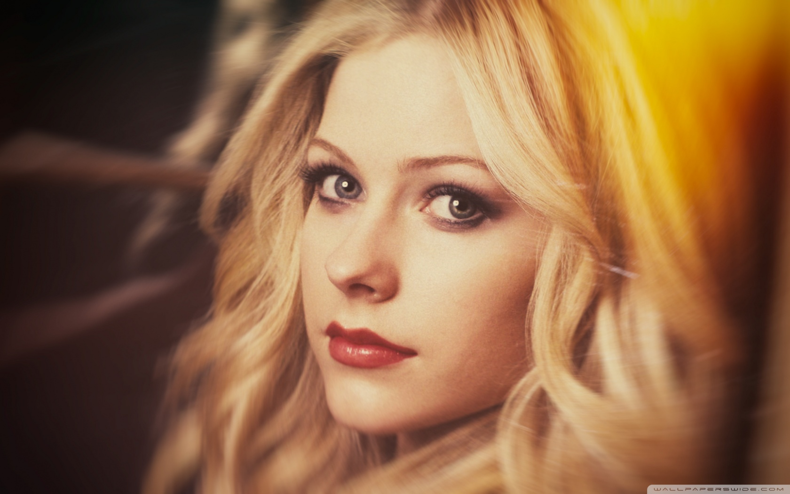
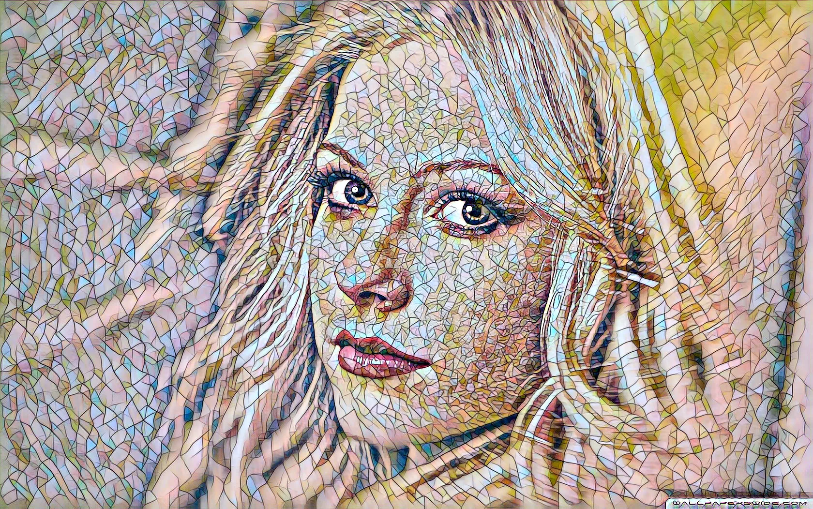

# 🎨 Neural Style Transfer Studio

Transform your images into stunning works of art using state-of-the-art deep learning! This application uses Fast Neural Style Transfer to apply artistic styles to your photos in real-time.

<p align="center">
  
  <br/>
  <em>Easy-to-use Gradio web interface</em>
</p>


## ✨ Features

- 🖼️ **High-Quality Style Transfer** - Apply artistic styles to your images using pre-trained neural networks
- 📹 **Real-Time Webcam Processing** - Transform your webcam feed into living art (GPU recommended)
- 🎨 **Multiple Artistic Styles** - Choose from 4 unique pre-trained styles:
  - **Mosaic** - Abstract geometric patterns
  - **Candy** - Vibrant, colorful pop art
  - **Rain Princess** - Beautiful impressionist painting style
  - **Udnie** - Abstract expressionism
- 🎚️ **Adjustable Intensity** - Control the strength of style application (0-100%)
- 🚀 **Fast Inference** - Optimized for speed with GPU acceleration support
- 🌐 **Web Interface** - Easy-to-use Gradio interface accessible from any browser
- 💾 **Download Results** - Save your styled images directly from the interface

## 🖼️ Examples

### Gallery

<p align="center">
  
  <br/>
  <em>Original Image</em>
</p>

<table>
  <tr>
    <td align="center">
      
      <br/>
      <b>Mosaic</b>
      <br/>
      <em>Abstract geometric patterns</em>
    </td>
    <td align="center">
      
      <br/>
      <b>Candy</b>
      <br/>
      <em>Vibrant pop art</em>
    </td>
  </tr>
  <tr>
    <td align="center">
      
      <br/>
      <b>Rain Princess</b>
      <br/>
      <em>Impressionist painting</em>
    </td>
    <td align="center">
      
      <br/>
      <b>Udnie</b>
      <br/>
      <em>Abstract expressionism</em>
    </td>
  </tr>
</table>

### Before & After Comparison

| Original | Styled (Mosaic) |
|----------|-----------------|
|  |  |


## 🛠️ Installation

### Prerequisites

- Python 3.8 or higher
- pip package manager
- (Optional) CUDA-capable GPU for real-time webcam processing

### Setup

1. **Clone the repository**
```bash
git clone <repository-url>
cd style-transfer-studio
```

2. **Install dependencies**
```bash
pip install torch torchvision
pip install gradio pillow numpy opencv-python
```

Or install from requirements.txt:
```bash
pip install -r requirements.txt
```

3. **Run the application**
```bash
python style_transfer.py
```

The application will:
- Automatically download pre-trained models (~7MB each) on first run
- Launch a Gradio web interface at `http://localhost:7860`
- Open the interface in your default browser

## 🚀 Usage

### Image Style Transfer

1. Navigate to the **"📸 Image Style Transfer"** tab
2. Upload an image or drag & drop
3. Select your desired artistic style from the dropdown
4. Adjust the intensity slider (100% = full style, 0% = original)
5. Click **"✨ Apply Style"**
6. Download your styled image!

### Real-Time Webcam

1. Navigate to the **"📹 Real-Time Webcam"** tab
2. Allow camera permissions in your browser
3. Select an artistic style
4. Adjust intensity for real-time preview
5. Your webcam feed will be stylized in real-time!

**Note:** For smooth real-time performance, a GPU is highly recommended.

## 🧠 Technical Details

### Model Architecture

This project implements **Fast Neural Style Transfer** based on:
- [Perceptual Losses for Real-Time Style Transfer and Super-Resolution](https://arxiv.org/abs/1603.08155) (Johnson et al., 2016)
- [Instance Normalization](https://arxiv.org/pdf/1607.08022.pdf) for improved quality

**Network Structure:**
- Encoder: 3 convolutional layers with Instance Normalization
- Transformer: 5 residual blocks
- Decoder: 2 upsampling layers with fractionally-strided convolutions
- Output: Tanh activation for pixel-perfect reconstruction

### Pre-trained Models

Models are trained on the [MS-COCO dataset](https://cocodataset.org/) and automatically downloaded from the official PyTorch examples repository on first run.

### Performance

| Device | Resolution | Processing Time | FPS (Webcam) |
|--------|-----------|-----------------|--------------|
| CPU (Intel i7) | 512x512 | ~2-3 seconds | ~0.3-0.5 FPS |
| GPU (RTX 3060) | 512x512 | ~0.1 seconds | ~10-15 FPS |
| GPU (RTX 4090) | 1024x1024 | ~0.15 seconds | ~20-30 FPS |

## 📁 Project Structure

```
style-transfer-studio/
├── style_transfer.py       # Main application file
├── requirements.txt        # Python dependencies
├── readme.md              # This file
└── style_models/          # Downloaded models (auto-created)
    ├── mosaic.pth
    ├── candy.pth
    ├── rain_princess.pth
    └── udnie.pth
```

## ⚙️ Configuration

### Gradio Interface Settings

Edit `style_transfer.py` to customize:

```python
demo.launch(
    share=False,           # Set to True for public URL
    server_name="0.0.0.0", # Change to "127.0.0.1" for local only
    server_port=7860,      # Change port if needed
    show_error=True
)
```

### GPU/CPU Selection

The application automatically detects and uses GPU if available. To force CPU:

```python
app = StyleTransferApp()
app.engine.device = 'cpu'
```

## 🔧 Troubleshooting

### Models Not Downloading

If automatic download fails, manually download from:
- [PyTorch Examples - Dropbox Link](https://www.dropbox.com/s/lrvwfehqdcxoza8/saved_models.zip?dl=1)
- Extract `.pth` files to `style_models/` directory

### Out of Memory Errors

For large images or limited RAM:
- Reduce image resolution before processing
- Lower intensity for less memory usage
- Use CPU instead of GPU for very large images

### Slow Performance

- Ensure GPU drivers are installed (CUDA for NVIDIA)
- Close other GPU-intensive applications
- Reduce webcam resolution in browser settings
- Lower style intensity slider

## 📚 Dependencies

- **PyTorch** - Deep learning framework
- **torchvision** - Computer vision utilities
- **Gradio** - Web interface framework
- **Pillow** - Image processing
- **NumPy** - Numerical operations
- **OpenCV** - Video processing

## 🤝 Contributing

Contributions are welcome! Areas for improvement:
- Additional style models
- Batch processing support
- Style blending (mix multiple styles)
- Custom style training interface
- Mobile optimization

## 📄 License

This project is licensed under the MIT License. See LICENSE file for details.

## 🙏 Acknowledgments

- **PyTorch Examples** - Pre-trained models and architecture reference
- **Johnson et al.** - Fast Neural Style Transfer paper
- **Gradio Team** - Excellent web interface framework
- **MS-COCO Dataset** - Training data for style models

## 📞 Support

For issues, questions, or suggestions:
- Open an issue on GitHub
- Check existing issues for solutions
- Review the troubleshooting section above

## 🌟 Star History

If you find this project useful, please consider giving it a star! ⭐

---

**Made with Dave❤️ using PyTorch and Gradio**